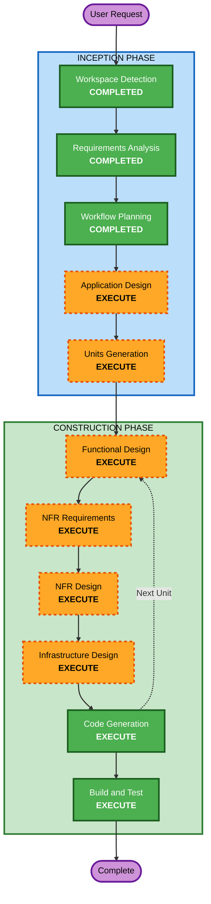

# Execution Plan

## Detailed Analysis Summary

### Change Impact Assessment
- **User-facing changes**: Yes — 고객 주문 UI, 추천/평가 시스템, 관리자 대시보드 전체 신규 구현
- **Structural changes**: Yes — 전체 시스템 아키텍처 신규 설계 (Spring Boot + React + MySQL + S3 + SSE)
- **Data model changes**: Yes — 매장, 테이블, 메뉴, 주문, 주문이력, 추천 데이터, 평가 데이터 등 전체 스키마 설계 필요
- **API changes**: Yes — 전체 REST API 신규 설계
- **NFR impact**: Yes — SSE 실시간 통신, JWT 인증, S3 이미지 관리, ECS 배포

### Risk Assessment
- **Risk Level**: Medium
- **Rollback Complexity**: Easy (신규 프로젝트이므로 롤백 리스크 낮음)
- **Testing Complexity**: Complex (SSE 실시간, 추천 알고리즘, 세션 관리, S3 연동 등)

---

## Workflow Visualization



### Text Alternative
```
Phase 1: INCEPTION
  - Workspace Detection (COMPLETED)
  - Requirements Analysis (COMPLETED)
  - Workflow Planning (COMPLETED)
  - User Stories (SKIPPED)
  - Application Design (EXECUTE)
  - Units Generation (EXECUTE)

Phase 2: CONSTRUCTION (per unit)
  - Functional Design (EXECUTE)
  - NFR Requirements (EXECUTE)
  - NFR Design (EXECUTE)
  - Infrastructure Design (EXECUTE)
  - Code Generation (EXECUTE)
  - Build and Test (EXECUTE)
```

---

## Phases to Execute

### INCEPTION PHASE
- [x] Workspace Detection (COMPLETED)
- [x] Reverse Engineering — SKIPPED
  - **Rationale**: Greenfield 프로젝트, 기존 코드 없음
- [x] Requirements Analysis (COMPLETED)
- [x] User Stories — SKIPPED
  - **Rationale**: 요구사항이 충분히 구체적이며 사용자가 스킵을 선택함. 고객/관리자 두 페르소나는 요구사항에서 이미 명확히 구분됨
- [x] Workflow Planning (IN PROGRESS)
- [ ] Application Design — EXECUTE
  - **Rationale**: 신규 시스템으로 컴포넌트, 서비스 레이어, 컴포넌트 간 의존성 설계 필요. Spring Boot 백엔드, React 프론트엔드, 추천 엔진, SSE 통신 등 복합 아키텍처
- [ ] Units Generation — EXECUTE
  - **Rationale**: 복잡한 시스템으로 다중 유닛 분해 필요. 백엔드 API, 프론트엔드 UI, 추천/평가 시스템 등 독립적 개발 단위 분리
pplication-design-plan.md       
### CONSTRUCTION PHASE (per unit)
- [ ] Functional Design — EXECUTE
  - **Rationale**: 새로운 데이터 모델 (Store, Table, Menu, Order, OrderHistory, Rating, DemographicData), 복잡한 비즈니스 로직 (추천 알고리즘, 세션 관리, SSE 이벤트)
- [ ] NFR Requirements — EXECUTE
  - **Rationale**: SSE 2초 이내 응답, JWT 16시간 세션, S3 이미지 관리, ECS 배포 요건 존재
- [ ] NFR Design — EXECUTE
  - **Rationale**: NFR Requirements 실행에 따른 패턴 설계 필요
- [ ] Infrastructure Design — EXECUTE
  - **Rationale**: AWS ECS 배포, S3 연동, MySQL RDS, 매장별 독립 인스턴스 아키텍처 설계 필요
- [ ] Code Generation — EXECUTE (ALWAYS)
  - **Rationale**: 구현 필수
- [ ] Build and Test — EXECUTE (ALWAYS)
  - **Rationale**: 빌드, 테스트, 검증 필수

### OPERATIONS PHASE
- [ ] Operations — PLACEHOLDER
  - **Rationale**: 향후 배포 및 모니터링 워크플로우

---

## Success Criteria
- **Primary Goal**: 테이블오더 MVP 완성 — 고객 주문, 관리자 모니터링, 추천/평가 시스템 포함
- **Key Deliverables**:
  - Spring Boot 백엔드 (REST API + SSE)
  - React TypeScript 프론트엔드 (고객용 + 관리자용)
  - MySQL 데이터베이스 스키마 및 마이그레이션
  - AWS ECS 배포 구성
  - S3 이미지 업로드 기능
  - 성별/나이대 기반 메뉴 추천 시스템
  - 메뉴별 별점 평가 시스템
- **Quality Gates**:
  - 단위 테스트 통과
  - 통합 테스트 통과 (API → DB → SSE)
  - 프론트엔드 빌드 성공
  - 로컬 환경 E2E 동작 확인
